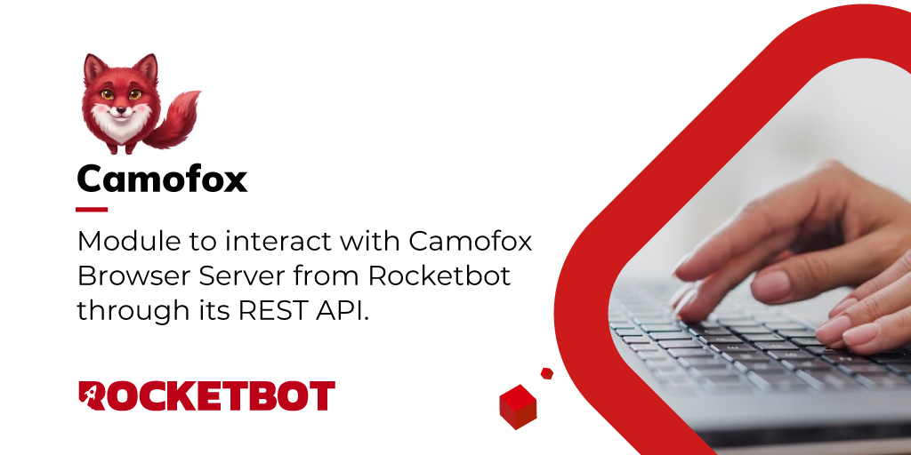

# Camofox
  
Modulo para interactuar con Camofox Browser Server desde Rocketbot mediante API REST. Permite verificar el servidor, crear pestanas, navegar, obtener snapshots, hacer click, escribir texto y tomar screenshots.  

*Read this in other languages: [English](Manual_camofox.md), [Português](Manual_camofox.pr.md), [Español](Manual_camofox.es.md)*
  

## Como instalar este módulo
  
Para instalar el módulo en Rocketbot Studio, se puede hacer de dos formas:
1. Manual: __Descargar__ el archivo .zip y descomprimirlo en la carpeta modules. El nombre de la carpeta debe ser el mismo al del módulo y dentro debe tener los siguientes archivos y carpetas: \__init__.py, package.json, docs, example y libs. Si tiene abierta la aplicación, refresca el navegador para poder utilizar el nuevo modulo.
2. Automática: Al ingresar a Rocketbot Studio sobre el margen derecho encontrara la sección de **Addons**, seleccionar **Install Mods**, buscar el modulo deseado y presionar install.  

## Como usar este modulo
Este módulo es una alternativa a otros módulos web como WebPro. Utiliza un navegador basado en Firefox orientado a automatización y técnicas anti-detección, ejecutándose en segundo plano. 

1. Para poder ocupar este modulo es necesario instalar Node.js en la maquina,asi como, instalar el paquete de Camoufox desde la consola (CMD o terminal) con este comando `npx -y @askjo/camofox-browser`.

2. El módulo opera en modo headless (segundo plano), por lo que no se renderiza visualmente una instancia del navegador.
La validación del estado de la página debe realizarse mediante el uso del comando de captura de pantalla.

3. Para obtener los elementos con los que se desea interactuar en este módulo, se debe utilizar el comando obtener snapshot.Este comando devuelve un árbol estructurado de la página (basado en el DOM), donde cada elemento se representa mediante identificadores internos como [e1], [e2], [e3], correspondientes a la pestaña abierta en Camoufox.

4. Las 
descargas realizadas con el módulo se generan en segundo plano y se almacenan inicialmente en la carpeta Temp del sistema.Sin embargo, mediante el comando “descargar archivo”, es posible mover el archivo desde esta ubicación temporal hacia la ruta deseada, por ejemplo, la carpeta de Descargas de Windows u otra ubicación personalizada definida por el usuario.

5. El módulo puede presentar variaciones en el tiempo de respuesta, por lo que la creación de pestañas u otras acciones pueden tardar en reflejarse o no ejecutarse de forma inmediata. Se recomienda validar cada acción antes de continuar con la siguiente.

6. Durante la ejecución en entorno de desarrollo, la sesión puede perderse si existe inactividad o demoras entre acciones, lo que puede provocar el error:
Failed to establish a new connection: [WinError 10061], lo que indica que es necesario reiniciar el servidor para restablecer la conexión.

7. Debido a las técnicas de evasión de detección (anti-bot) que utiliza Camoufox, el 
navegador puede alterar dinámicamente la resolución, el tamaño del viewport (ventana gráfica) o simular diferentes dispositivos en cada sesión. Como consecuencia, las capturas de pantalla tomadas en segundo plano pueden renderizarse con dimensiones variables o mostrarse incompletas.

## Descripción de los comandos

### Iniciar Servidor
  
Inicia el servidor de Camofox Browser en segundo plano.
|Parámetros|Descripción|ejemplo|
| --- | --- | --- |
|URL base|URL del servidor Camofox. Por defecto http//localhost9377|http://localhost:9377|
|User ID||rb-test|
|Ruta del servidor|Carpeta desde donde se iniciara el proceso de Camofox. Si se usa npm start, indicar la carpeta del repositorio camofox-browser.|C:/Users/pc/Downloads|
|Comando de inicio|Comando utilizado para iniciar Camofox. Por defecto npx -y @askjo/camofox-browser|npx -y @askjo/camofox-browser|
|Segundos de espera||20|
|Asignar resultado a variable||resultado|

### Verificar Servidor
  
Verifica si el servidor de Camofox esta activo y accesible.
|Parámetros|Descripción|ejemplo|
| --- | --- | --- |
|URL base|URL del servidor Camofox. Por defecto http//localhost9377|http://localhost:9377|
|User ID||rb-test|
|Asignar resultado a variable||resultado|

### Crear Pestana
  
Crea una nueva pestana de Camofox y abre la URL indicada.
|Parámetros|Descripción|ejemplo|
| --- | --- | --- |
|URL base||http://localhost:9377|
|User ID||rb-test|
|URL||https://example.com|
|Clave de sesion||default|
|Timeout de solicitud (segundos)||60|
|Asignar resultado a variable||resultado|

### Navegar
  
Navega una pestana existente de Camofox hacia una nueva URL.
|Parámetros|Descripción|ejemplo|
| --- | --- | --- |
|URL base||http://localhost:9377|
|User ID||rb-test|
|ID de pestana||tabId|
|URL||https://example.com|
|Asignar resultado a variable||resultado|

### Obtener Snapshot
  
Obtiene el snapshot accesible de una pestana de Camofox.
|Parámetros|Descripción|ejemplo|
| --- | --- | --- |
|URL base||http://localhost:9377|
|User ID||rb-test|
|ID de pestana||tabId|
|Asignar resultado a variable||resultado|

### Click
  
Hace click en un elemento usando su referencia del snapshot.
|Parámetros|Descripción|ejemplo|
| --- | --- | --- |
|URL base||http://localhost:9377|
|User ID||rb-test|
|ID de pestana||tabId|
|Referencia del elemento||e1|
|Asignar resultado a variable||resultado|

### Escribir Texto
  
Escribe texto en un elemento usando su referencia del snapshot.
|Parámetros|Descripción|ejemplo|
| --- | --- | --- |
|URL base||http://localhost:9377|
|User ID||rb-test|
|ID de pestana||tabId|
|Referencia del elemento||e1|
|Texto||Text to type|
|Presionar Enter despues de escribir|||
|Asignar resultado a variable||resultado|

### Screenshot
  
Obtiene una captura de pantalla de una pestana de Camofox.
|Parámetros|Descripción|ejemplo|
| --- | --- | --- |
|URL base||http://localhost:9377|
|User ID||rb-test|
|ID de pestana||tabId|
|Ruta de guardado (opcional)||C:\tmp\camofox_capture.png|
|Asignar resultado a variable||resultado|

### Detener Servidor
  
Detiene el servidor de Camofox Browser usando el PID del proceso.
|Parámetros|Descripción|ejemplo|
| --- | --- | --- |
|PID|PID devuelto por el comando Iniciar Servidor.|12345|
|Asignar resultado a variable||resultado|

### Descargar Archivo
  
Monitorea y captura descargas de forma nativa en la carpeta temporal de CamoFox en formatos Excel, PDF, TXT Y ZIP.
|Parámetros|Descripción|ejemplo|
| --- | --- | --- |
|URL base|URL del servidor Camofox. Por defecto http//localhost9377|http://localhost:9377|
|User ID||rb-test|
|ID Pestana|ID de la pestaña de CamoFox desde donde se ejecuta la descarga.|tab_1|
|Ruta de guardado|Ruta donde se guardará el archivo. Si no se especifica, por defecto se creará en el directorio actual con la extensión del formato elegido.|C:\Users\Downloads\cartola.xlsx|
|Tipo de Archivo|Formato a descargar Excel, PDF, TXT o ZIP.||
|Sobrescribir si existe|||
|Asignar resultado a variable||resultado|

### Ejecutar JS
  
Ejecuta una expresion JavaScript en la pestana actual.
|Parámetros|Descripción|ejemplo|
| --- | --- | --- |
|URL base||http://localhost:9377|
|User ID||rb-test|
|ID de pestana||tabId|
|Expresion JS||JavaScript expression|
|Timeout de request||30|
|Asignar resultado a variable||resultado|

### Hover
  
Mueve el mouse sobre un elemento usando su referencia del snapshot o un selector CSS.
|Parámetros|Descripción|ejemplo|
| --- | --- | --- |
|URL base|URL del servidor Camofox. Por defecto http//localhost9377|http://localhost:9377|
|User ID|User ID utilizado al crear la pestana.|rb-test|
|ID de pestana||tabId|
|Referencia del elemento|Referencia del snapshot, por ejemplo e13. Usar referencia o selector.|e13|
|Selector CSS|Selector CSS. Se usa solo si no se informa referencia.|button.download|
|Asignar resultado a variable||resultado|
